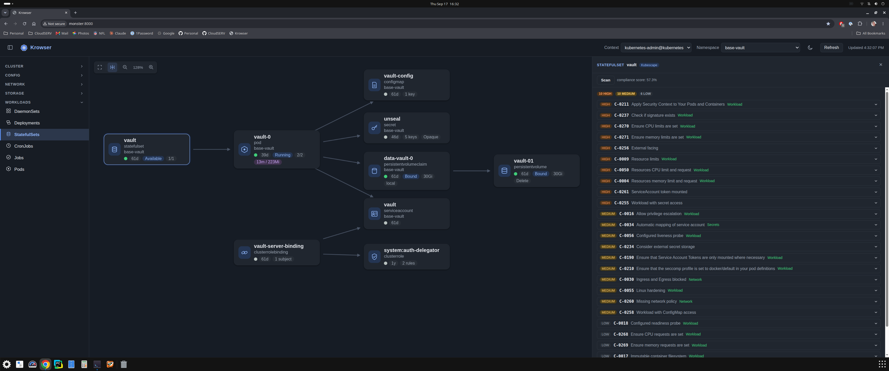
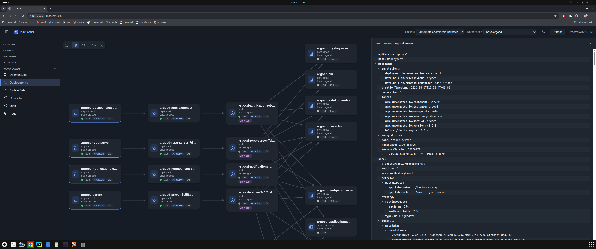

# krowser

A web app for browsing the resources in a Kubernetes cluster and how they relate to each other — pick a resource type, filter by namespace, and see an ArgoCD-style graph of ownership, networking, and storage relationships. Click any node to inspect its full YAML, read-only.

## Screenshots


*Deployments view (`base-tco` namespace) — Deployment → ReplicaSet → Pod ownership chain, with the resizable read-only YAML pane open.*


*StatefulSets view (`base-vault` namespace) — Services and EndpointSlices routing to the pod, alongside the Secret, ConfigMap, and PersistentVolumeClaim/PersistentVolume it uses.*

## Features

- Browse 13 resource types grouped into **Config** (ConfigMaps, Secrets), **Network** (Ingresses, Services), **Storage** (PersistentVolumes, PersistentVolumeClaims), and **Workloads** (DaemonSets, Deployments, StatefulSets, CronJobs, Jobs, Pods)
- Filter by namespace (or view all namespaces at once) and by kubeconfig context
- Relationship graph derived from real cluster state: owner references (e.g. Deployment→ReplicaSet→Pod), Service↔Pod label-selector matching, Ingress routing, PersistentVolumeClaim/PersistentVolume binding, ConfigMap/Secret usage (volume mounts, `envFrom`, individual env vars), and Service→EndpointSlice→Pod
- Click any node to open a resizable, read-only YAML pane for that resource, fetched fresh from the cluster
- Auto-refreshes on a polling interval without resetting your pan/zoom or losing your current selection unless the underlying resource set actually changes
- Read-only — no create/edit/delete/scale actions

## Requirements

- Python 3.11+
- A working kubeconfig with access to the cluster you want to browse

## Quick start

```bash
python3 -m venv .venv
source .venv/bin/activate   # on Windows: .venv\Scripts\activate
pip install -r requirements.txt
./run.sh
```

Then open `http://localhost:8000`.

## Configuration

Environment variables:

| Variable | Default | Description |
|---|---|---|
| `KUBECONFIG` | (system default, usually `~/.kube/config`) | Path to the kubeconfig file to load contexts from |
| `KROWSER_MAX_GRAPH_NODES` | `150` | Caps the number of root nodes shown in a single graph (e.g. when viewing a resource type across all namespaces); the response reports the true count and flags when it's been truncated |

## Development

Install the test tooling on top of the runtime dependencies, then run the test suite:

```bash
pip install -r requirements-dev.txt
pytest
```

## Project structure

```
krowser/
  krowser/
    main.py           # FastAPI app
    config.py          # environment-driven settings
    k8s/                # Kubernetes client wrapper, per-kind fetchers/getters, status/health logic
    graph/               # relationship-derivation and graph-building logic
    api/                  # HTTP routes
  static/
    index.html
    css/
    js/                 # Alpine.js components + Cytoscape.js graph rendering (no build step)
    vendor/              # vendored JS dependencies (Alpine, Cytoscape + extensions)
  tests/
```
